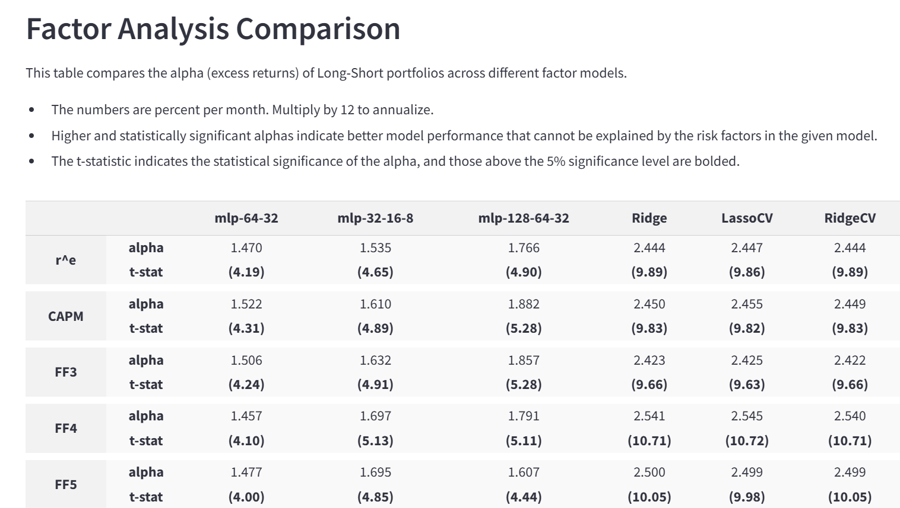

# Trading on stock return predictions

The [Lehigh Machine Learning Stock Prediction](https://lehighmlstockprediction.streamlit.app/) application was built to explain how practitioners 
create models to predict stock returns,
turn those predictions into a tradable portfolio, 
and assess its performance. 

- A practical explanation of the methods, the data used, and how it's done 
- Compare different models to see which makes a portfolio that generates the highest returns
- Dig into the details of each model to assess risk-adjusted returns and more

Visit the app and check it out! 

